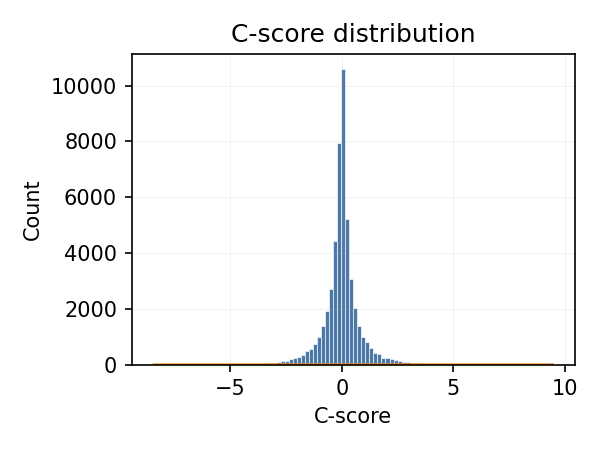
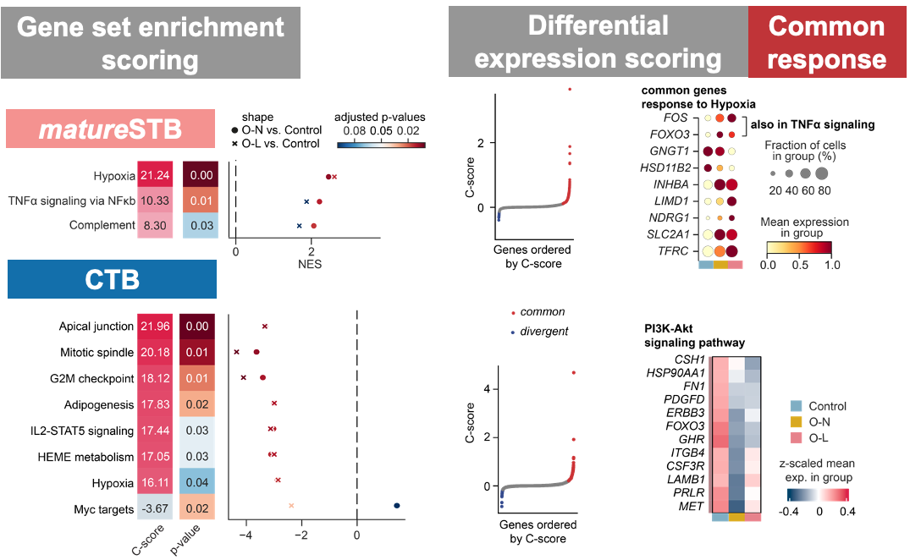
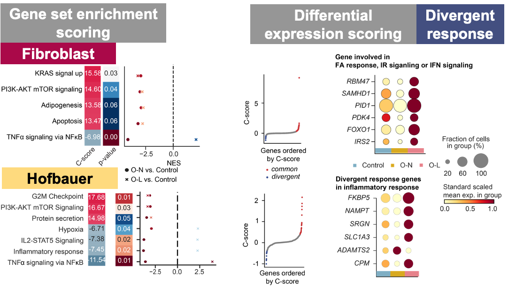
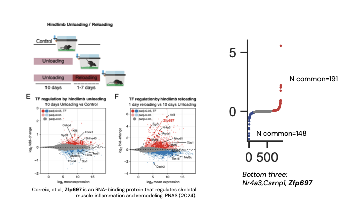

# C-score

Scoring the common and divergence of two comparisons of gene expression.


## Install with uv (from GitHub)

```bash
uv venv --python 3.12 && source .venv/bin/activate
uv pip install git+https://github.com/brainfo/cscore
```

## Usage

```bash
cscore -i testdata \
  -a GSE237099_1_unloading_reloading_cscore.txt \
  -b GSE237099_1_unloading_reloading_cscore_sign.txt \
  -o out.tsv
```

Specify a key column if your ID column is not the first column:

```bash
cscore -i testdata -a fileA.tsv -b fileB.tsv -o out.tsv -n gene_key
```

### Bulk RNA-seq (DESeq2) example

```bash
cscore -i testdata \
  -a GSE237099_1_unloading_reloading_Reloading_vs_Control_deseq2.txt \
  -b GSE237099_1_unloading_reloading_Unloading_vs_Control_deseq2.txt \
  -o out_bulk.tsv \
  -n ensembl_gene_id \
  -e log2FoldChange \
  -f padj
```

See `cscore -h` for all options. The legacy script `score.py` remains as a shim and will invoke the same CLI.

### Column names
- Default effect column: `avg_log2FC` (single-cell). Common alternatives auto-detected when not specified: `log2FoldChange`, `logFC`, `avg_logFC`.
- Default FDR column: `p_val_adj`. Alternatives auto-detected when not specified: `padj`, `FDR`, `q_value`.
- If you pass `-e/--effect` or `-f/--fdr`, those exact columns (case-insensitive) are required. Otherwise, the tool tries common variants and prints a warning only when it falls back.

### Output
The output TSV includes:
- `score`: C-score (positive = common direction; negative = divergent)
- `p`: permutation p-value for commonness/divergence
- `q_value`: Benjamini–Hochberg adjusted p-value across rows
- `convergence`: "high" when commonness dominates, "low" otherwise
- All columns from both inputs, suffixed with `_comp1`/`_comp2`
- `coding` (when `-g/--gtf` is provided and `-m gene`): boolean protein-coding annotation

### Options
- `-i, --input_folder`: Directory containing the two input TSV files
- `-a, --comp1_file`: First comparison TSV
- `-b, --comp2_file`: Second comparison TSV
- `-o, --output_file`: Output TSV path
- `-n, --gname`: Key column name (defaults to first column if omitted; warns what was used)
- `-e, --effect`: Effect size column (default `avg_log2FC`; accepts `log2FoldChange`, etc.)
- `-f, --fdr`: Adjusted p-value/FDR column (default `p_val_adj`; accepts `padj`, etc.)
- `-g, --gtf`: Gene annotation GTF for protein-coding annotation (mode `gene`)
- `-w, --workers`: Number of parallel workers (defaults to CPU count)
- `-s, --seed`: Random seed for permutations

### Performance
- Permutations: uses `n^2` if `n < 200`, else `40000` shuffles.
- Parallelization: batched permutations via joblib. Increase `-w` to speed up.
- Memory: aggregation avoids storing all permutations.

## Score formula


- Explanation

    

  - A positive score indicates that in the two comparisons, the genes were both increased or decreased.  The larger the score was in this case, the more common and larger fold changes it had.
  - Conversely, a negative score indicates the gene was differentially expressed oppositely in the two obese groups compared to the normal weight group. That’s to say, in one comparison it was increased while in another it was decreased and vice versa.
  - The smaller the score was, the more divergent and larger fold changes the gene had.
  - From this formula, the genes that were with both zero-fold changes were scored zero.
- C-score permutation test: by permuting $C_{OA}$ and $C_{OL}$ correspondance; p-value 0.05 for one-side test as significance
  - To measure the significance of the scores of the genes that were differentially expressed (score≠0), we performed a permutation test. The fold changes and FDRs of all these genes in each comparison were permutated 40,000 times if the number of genes with a score≠0 was over 200, otherwise, they are permutated (number of the genes)^2 times.
  - p-value = min(P(Score_perm>Score_obs), P(Score_perm<Score_obs))
  - if P(Score_perm>Score_obs) < P(Score_perm<Score_obs), then the sign is assigned as “high” commonness, otherwise, “low” commonness
- The $C_{OA}$ and $C_{OL}$  pairwise differential gene expression test: NB regression model was used with the formula “~ 1 + group + sex + log_number_of_genes” on raw counts.

    We performed differential expression analyses using a wald test with a negative binomial regression model was used with the formula “~ 1 + group + sex + log_number_of_genes” on raw counts. By default, in FindMarkers function in Seurat, genes with more than one count in at least 1% of cells were considered. This rendered 6,000 to 7,000 genes to be analyzed. FDR was controlled with Benjamini-Hochberg procedure.

- The $C_{OA}$ and $C_{OL}$ gene set enrichment test

    GSEA based on fold changes,  FDR was controlled with Benjamini-Hochberg procedure.

### Simulation

`n=10000, mu_fc1=0.0, mu_fc2=0.0, sd_fc=1.0, fdr_alpha=0.1, seed=1234`



## Example preprint

In [Decoding human placental cellular and molecular responses to obesity and fetal growth](https://www.biorxiv.org/content/10.1101/2025.01.27.634981v3.abstract), we analyzed single-nucleus RNA-seq data from placentas of normal-weight women (Control), and women with obesity who were further divided by fetal birth weight into appropriate- (O-A) and large-for-gestational age (O-L) groups.

(With the C-scoring), → the following (aimed) results:

We dissected the transcriptional responses in each placental cell type, identifying the **shared responses in O-A and O-L as common obesity responses** and **divergent responses in O-A or O-L groups as responses associated with (or modulated by) fetal overgrowth.**

### Results

#### Nuclei number and gene set size

|  |  |  | Nuclei number | Common gene | Divergent gene |
| --- | --- | --- | --- | --- | --- |
| mature STB | Control | female | 2143 | 243 | 18 |
|  |  | male | 3571 |  |  |
|  | O-A | female | 2024 |  |  |
|  |  | male | 3402 |  |  |
|  | O-L | female | 3572 |  |  |
|  |  | male | 985 |  |  |

|  |  |  | Nuclei number | Common gene | Divergent gene |
| --- | --- | --- | --- | --- | --- |
| Hofbauer cells | Control | female | 170 | 30 | 14 |
|  |  | male | 333 |  |  |
|  | O-A | female | 309 |  |  |
|  |  | male | 304 |  |  |
|  | O-L | female | 148 |  |  |
|  |  | male | 460 |  |  |

#### Example table results

Top 10 from mature STB:

| Gene symbol | avg_log2FC_comp1 | p_val_adj_comp1 | avg_log2FC_comp2 | p_val_adj_comp2 | score | p | convergence |
| --- | --- | --- | --- | --- | --- | --- | --- |
| LINC02109 | -1.4270651 | <1E-64 | -1.3437818 | <1E-64 | 3.65018009 | <2.5E-5 | high |
| FLT1 | 0.86430618 | <1E-64 | 1.22226231 | <1E-64 | 1.87806805 | <2.5E-5 | high |
| PAPPA2 | 0.8192974 | <1E-64 | 1.11021083 | <1E-64 | 1.65941486 | <2.5E-5 | high |
| GULP1 | 0.81878912 | <1E-64 | 0.84530435 | <1E-64 | 1.37033081 | 0.000025 | high |
| INHBA | 0.8746773 | <1E-64 | 0.79208514 | <1E-64 | 1.34665603 | <2.5E-5 | high |
| KIF2A | 0.66429783 | <1E-64 | 0.64340232 | <1E-64 | 0.85092193 | 0.000475 | high |
| NRIP1 | 0.429781 | <1E-64 | 0.87480154 | <1E-64 | 0.78978173 | 0.00055 | high |
| PLCB1 | 0.79931583 | <1E-64 | 0.45914847 | <1E-64 | 0.75058569 | 0.0006 | high |
| MYOF | 0.53225947 | <1E-64 | 0.67421082 | <1E-64 | 0.71230296 | 0.001125 | high |
| CCSAP | 0.49901498 | <1E-64 | 0.70728805 | <1E-64 | 0.70613485 | 0.00075 | high |

Bottom 10 from mature STB:

| Gene symbol | avg_log2FC_comp1 | p_val_adj_comp1 | avg_log2FC_comp2 | p_val_adj_comp2 | score | p | convergence |
| --- | --- | --- | --- | --- | --- | --- | --- |
| PSG4 | 0.68256614 | <1E-64 | -0.1359119 | <1E-64 | -0.3981456 | 0.00465 | low |
| PKIB | 0.73425046 | <1E-64 | -0.1833735 | 1 | -0.3885055 | 0.0052 | low |
| PTPRD | -0.7250937 | <1E-64 | 0.04241386 | 1 | -0.3225998 | 0.0083 | low |
| ZNF117 | 0.61611267 | <1E-64 | -0.1540662 | 1 | -0.2936163 | 0.010375 | low |
| LIFR | 0.64551658 | <1E-64 | -0.0722132 | 1 | -0.2815569 | 0.01135 | low |
| AHR | 0.46459837 | <1E-64 | -0.1773638 | 2.9154E-05 | -0.2813846 | 0.01125 | low |
| TRMT9B | 0.31680759 | <1E-64 | -0.2878356 | <1E-64 | -0.2776362 | 0.012225 | low |
| CHSY1 | 0.36698856 | <1E-64 | -0.2445903 | <1E-64 | -0.2736151 | 0.01275 | low |
| FOXP1 | 0.58627916 | <1E-64 | -0.0876014 | 1 | -0.2490622 | 0.016175 | low |
| ANO2 | 0.62528221 | <1E-64 | -0.0083019 | 1 | -0.2437539 | 0.016425 | low |

Distribution of the observed C-score, see below the visualization:

#### Visualization





### Testing with the public bulk RNA-seq study


