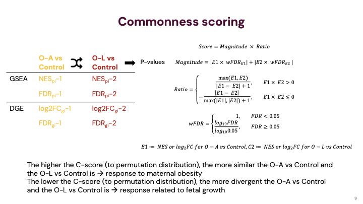

# C-score

[](https://denglab-ki.github.io/cscore/)

Scoring the common and divergence of two comparisons of gene expression.


## Install with uv

```bash
pip install git+https://github.com/denglab-ki/cscore
```

## Usage

```bash
cscore -i testdata -a fileA.tsv -b fileB.tsv -o out.tsv -n gene_key
```

### Input
- Default effect column: `avg_log2FC` (single-cell). Common alternatives auto-detected when not specified: `log2FoldChange`, `logFC`, `avg_logFC`.
- Default FDR column: `p_val_adj`. Alternatives auto-detected when not specified: `padj`, `FDR`, `q_value`.
- If you pass `-e/--effect` or `-f/--fdr`, those exact columns (case-insensitive) are required. Otherwise, the tool tries common variants and prints a warning only when it falls back.

### Output
The output TSV includes:
- `score`: C-score (positive = common direction; negative = divergent)
- `p`: permutation p-value for commonness/divergence
- `q_value`: Benjamini–Hochberg adjusted p-value across rows
- `convergence`: "high" when commonness dominates, "low" otherwise
- All columns from both inputs, suffixed with `_comp1`/`_comp2`
- `coding` (when `-g/--gtf` is provided and `-m gene`): boolean protein-coding annotation

### Options
- `-i, --input_folder`: Directory containing the two input TSV files
- `-a, --comp1_file`: First comparison TSV
- `-b, --comp2_file`: Second comparison TSV
- `-o, --output_file`: Output TSV path
- `-n, --gname`: Key column name (defaults to first column if omitted; warns what was used)
- `-e, --effect`: Effect size column (default `avg_log2FC`; accepts `log2FoldChange`, etc.)
- `-f, --fdr`: Adjusted p-value/FDR column (default `p_val_adj`; accepts `padj`, etc.)
- `-g, --gtf`: Gene annotation GTF for protein-coding annotation (mode `gene`)
- `-w, --workers`: Number of parallel workers (defaults to CPU count)
- `-s, --seed`: Random seed for permutations


## Score formula



- Explanation

    

  - A positive score indicates that in the two comparisons, the genes were both increased or decreased.  The larger the score was in this case, the more common and larger fold changes it had.
  - Conversely, a negative score indicates the gene was differentially expressed oppositely in the two obese groups compared to the normal weight group. That’s to say, in one comparison it was increased while in another it was decreased and vice versa.
  - The smaller the score was, the more divergent and larger fold changes the gene had.
  - From this formula, the genes that were with both zero-fold changes were scored zero.
- C-score permutation test: by permuting $C_{OA}$ and $C_{OL}$ correspondance; p-value 0.05 for one-side test as significance
  - To measure the significance of the scores of the genes that were differentially expressed (score≠0), we performed a permutation test. The fold changes and FDRs of all these genes in each comparison were permutated 40,000 times if the number of genes with a score≠0 was over 200, otherwise, they are permutated (number of the genes)^2 times.
  - p-value = min(P(Score_perm>Score_obs), P(Score_perm<Score_obs))
  - if P(Score_perm>Score_obs) < P(Score_perm<Score_obs), then the sign is assigned as “high” commonness, otherwise, “low” commonness
